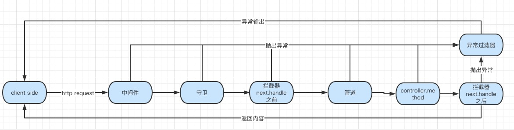

##目录

[控制器（controllers)](./docs/controllers.md)
[提供者（providers)](./docs/providers.md)
[模块（modules)](./docs/modules.md)
[中间件（middleware)](./docs/middleware.md)
[异常过滤器（exception filters)](./docs/filters.md)
[管道（pipes)](./docs/pipes.md)
[守卫（guards)](./docs/guards.md)
[拦截器（interceptors)](./docs/interceptors.md)
[自定义装饰器（custom decorators)](./docs/decorators.md)

